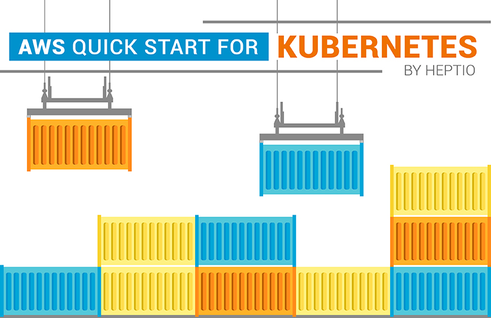

# VMware AWS Quickstart

[][certified] These
are the CloudFormation templates for the VMware AWS Quick Start.  This is where
active development is happening.

Details of the Quick Start are in this [Heptio Blog post][details].

Amazon's page for this is [here][amazon].

This will be updated and pushed regularly to
https://github.com/aws-quickstart/quickstart-vmware.

[certified]: https://github.com/cncf/k8s-conformance/tree/master/v1.11/heptio
[details]: https://blog.heptio.com/aws-quickstart-for-kubernetes-26ccaf7e1c8f#.aqb0bit5l
[amazon]: https://aws.amazon.com/quickstart/architecture/vmware-kubernetes/

## Deploying the latest release

The canonical way to deploy this Quick Start is by following the "Deploy on AWS
into a new VPC" link on this project's [AWS Quick Start Page][qs-arch].

[qs-arch]: https://aws.amazon.com/quickstart/architecture/vmware-kubernetes/

You can see what's behind that link by checking AWS's fork of VMware's
repository at https://github.com/aws-quickstart/quickstart-vmware.  The `master`
branch of github.com/heptio/aws-quickstart is merged into AWS's repository and
deployed to the Quick Start page on a monthly basis.

### Latest release from the command line

You can also deploy the latest release of this Quick Start via the command line
using the [helper script provided in this repo][deploy-published].

[deploy-published]: /bin/boot-latest-published.sh

## Deploying latest master

You can try changes from this repository before they are released on the AWS
Quick Start page using the AWS Console.

**[Launch Latest Quickstart Now][launch]**

[launch]: https://console.aws.amazon.com/cloudformation/home#/stacks/create/review?param_QSS3BucketName=vmware-aws-quickstart-test&param_QSS3KeyPrefix=vmware%2Fkubernetes%2Fmaster%2F&stackName=VMware-Kubernetes&templateURL=https:%2F%2Fvmware-aws-quickstart-test.s3.amazonaws.com%2Fvmware%2Fkubernetes%2Fmaster%2Ftemplates%2Fkubernetes-cluster-with-new-vpc.template

### Master branch from the command line

You can deploy the master branch of this Quick Start using the [provided
script][deploy-master].

[deploy-master]: /bin/boot-master-branch.sh

## Deploying local changes

Use the provided script [boot-cloud-from-local.sh][boot-local]. This will upload
your local directory and run the cluster-with-new-vpc template on cloud
formation.

[boot-local]: /bin/boot-cloud-from-local.sh

If you're making changes to things like the Kubernetes version or anything
installed in the base AMI, you'll also need to rebuild the AMI with
[Wardroom][wardroom].  See the "Local development" section below for more
details.

Optionally, aws-quickstart also supports overriding a few select kubernetes
binaries (kubelet, kubeadm, kubectl) at runtime for development purposes.  To
replace these binaries at runtime, simply place your custom versions into the
`$S3_PREFIX/bin/` folder:

Optionally, aws-quickstart also supports overriding a few select kubernetes binaries (kubelet, kubeadm, kubectl) at runtime for development purposes.  To replace these binaries at runtime, simply place your custom versions into the `${S3_PREFIX}bin/` folder:
```
$ aws s3 ls s3://quickstart/overrides/bin/
2017-09-08 13:04:02   71453136 kubeadm
2017-09-08 12:58:27   72501019 kubectl
2017-09-08 12:58:27  146464528 kubelet
```

These will be downloaded during cloudformation initialization and subsequently
become available to the running instance.

## Wardroom Images

To ensure that the [wardroom][wardroom]-sourced AMIs are the ones we expect, our
CI checks that the tags in [`wardroom.json`](wardroom.json) match the tags for
every AMI in the cloudformation template. If the AMI images are updated,
`wardroom.json` will need to be changed as well to, at minimum, the new commit
hash.

[wardroom]: https://github.com/heptiolabs/wardroom

## Using the cluster

```
# Wait for the cluster to be up and running
aws cloudformation wait stack-create-complete --stack-name $STACK

# Get the command to download the kubeconfig file for the cluster
KUBECFG_DL=$(aws cloudformation describe-stacks --stack-name=$STACK --query 'Stacks[0].Outputs[?OutputKey==`GetKubeConfigCommand`].OutputValue' --output text)
echo $KUBECFG_DL
eval $KUBECFG_DL

# Set an environment variable to tell kubectl where to find this file
export KUBECONFIG=$(pwd)/kubeconfig
kubectl get nodes
```

## Local development

This Quick Start is developed as a set of AWS CloudFormation templates. This is
a brief overview of the files in this repo, for more architecture details see
the [Deployment
Guide](https://s3.amazonaws.com/quickstart-reference/vmware/latest/doc/vmware-kubernetes-on-the-aws-cloud.pdf)

**The `templates` directory**:

- `kubernetes-cluster.template` sets up the resources that the Kubernetes
  cluster depends on. Mainly this is the API load balancer, the master node, the
  auto-scaling group of kubelet nodes, and the various security groups required
  to allow them to talk to one another. The nodes in this template are created
  from a base AMI, which you can recreate using [wardroom][wardroom].
- `kubernetes-cluster-with-new-vpc.template` sets up a new VPC with a public and
  private subnets, and calls out to `kubernetes-cluster.template` as a
  sub-stack.

**The `scripts` directory**:

This contains files that are required by the templates. This is to avoid
inlining a lot of text directly in the template files. Templates access files
from this directory by referencing their S3 URL's, which is why this directory
and the `templates` directory both need to be copied into S3 in order to be
used.

Some notable files in this directory:

- `setup-k8s-master.sh.in`: This file is run by the master node on first boot as
  part of its initialization. It is a [Mustache
  template](https://mustache.github.io/) file, with template variables that are
  set by the `kubernetes-cluster.template` template. Note that this template
  file does not install the Kubernetes binaries, those are baked into the AMI.
- `calico.yaml`, `weave.yaml`: These are networking add-ons which are applied
  with `kubectl` by the master after the Kubernetes cluster is initialized.

